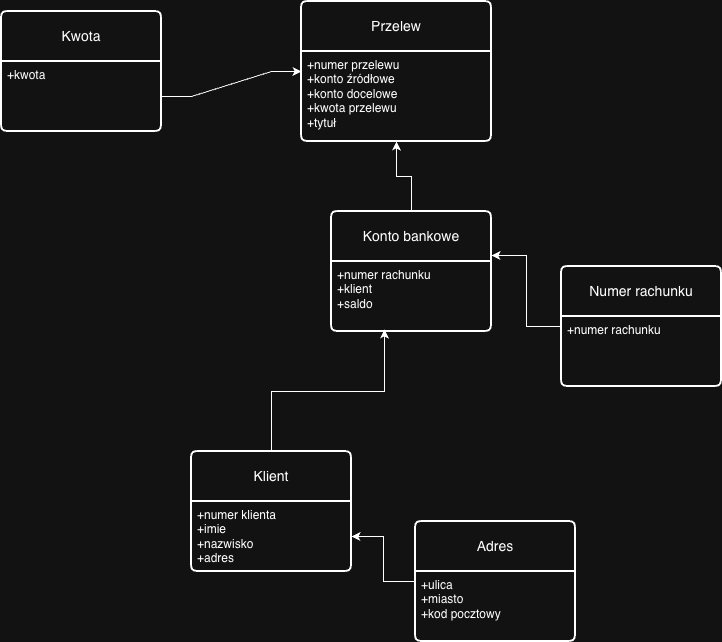

# Opis zadania
Celem zadania jest zamodelowanie fragmentu aplikacji bankowej odpowiadającej za zarządzanie
przelewami między kontami bankowymi wykorzystując Domain Driven Design. Podczas modelowania nalezy uwzględnić 
konteksty, agregaty, oraz obiekty wartości. Nalezy dla atrybutów encji określić akceptowalne formaty danych.

# Diagram modelu

# Tabele
## Agregaty
### Konto bankowe
| Nazwa atrybutu | Typ danych | Akceptowalny fomat danych
|:--------------:|:----------:|:-------------------------:|
|numer rachunku|NumerRachunku|[Zobacz Numer rachunku](#numer-rachunku)|
|klient|Klinet|[Zobacz Klient](#klient)|
|saldo|decimal|musi być nieujemne|

### Przelew
| Nazwa atrybutu | Typ danych | Akceptowalny fomat danych
|:--------------:|:----------:|:-------------------------:|
|numer przelewu|string|UUID|
|konto źródłowe|Konto Bankowe|[Zobacz konto bankowe](#konto-bankowe)|
|konto docelowe|Konto Bankowe|[Zobacz konto bankowe](#konto-bankowe)|
|kwota przelewnu|Kwota|[Zobacz kwota](#kwota)|
|tytuł|string|Znaki alpfanumeryczne, maksumalna długość 150|

## Encje
### Klient
| Nazwa atrybutu | Typ danych | Akceptowalny fomat danych
|:--------------:|:----------:|:-------------------------:|
|numer kliennta|string|UUID|
|imie|string|znaki alfabetyczne, maksymalna długość = 100|
|nazwisko|string|znaki alfabetyczne, maksymalna długość = 100|
|adres|Adres|[Zobacz Adres](#adres)|

## Obiekty wartości
### Numer rachunku
| Nazwa atrybutu | Typ danych | Akceptowalny fomat danych
|:--------------:|:----------:|:-------------------------:|
|numer IBAN|string|Format IBAN|

### Kwota
| Nazwa atrybutu | Typ danych | Akceptowalny fomat danych
|:--------------:|:----------:|:-------------------------:|
|kwota|decimal|musi być nieujemna|

### Adres
| Nazwa atrybutu | Typ danych | Akceptowalny fomat danych
|:--------------:|:----------:|:-------------------------:|
|ulica|string|znaki alpanumeryczne oraz -; maksymalna długość = 100|
|miasto|string|znaki alpanumeryczne oraz -; maksymalna długość = 100|
|kod pocztowy|string|format XX-XXX|