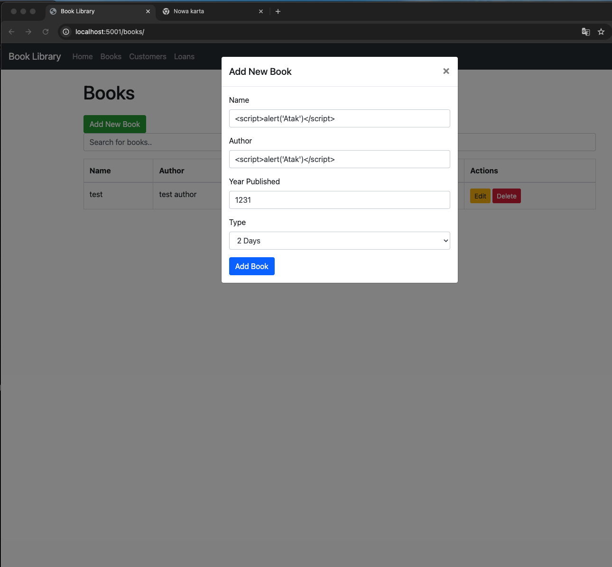
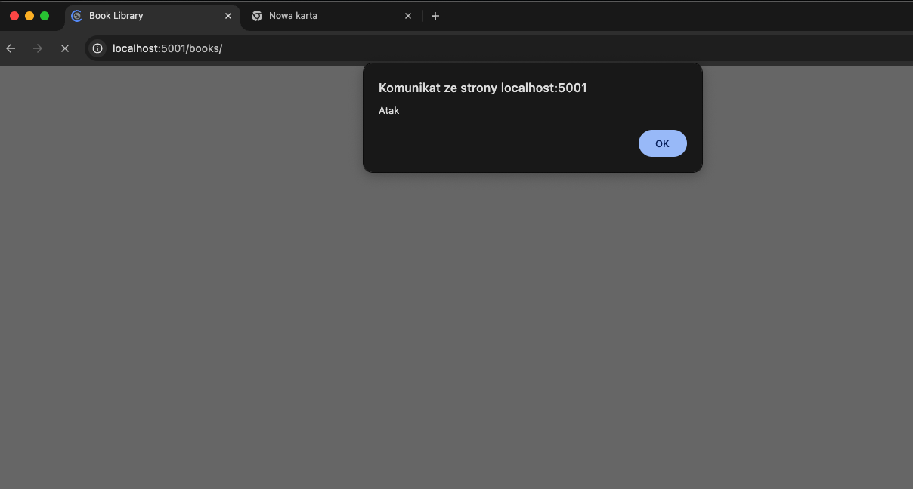
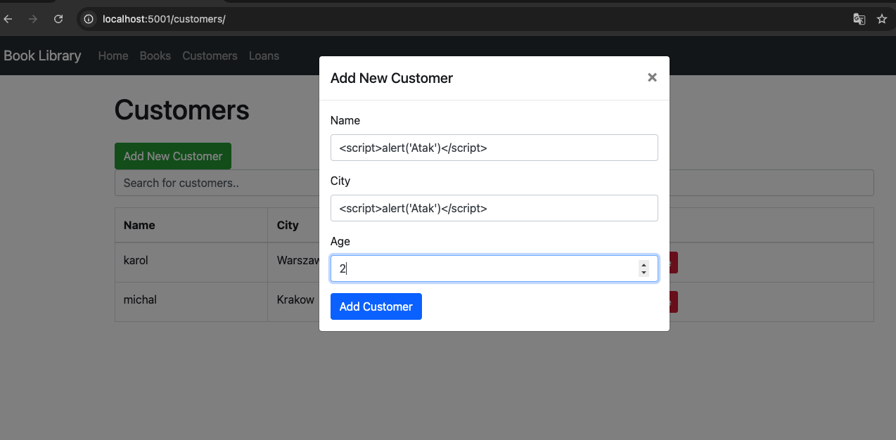
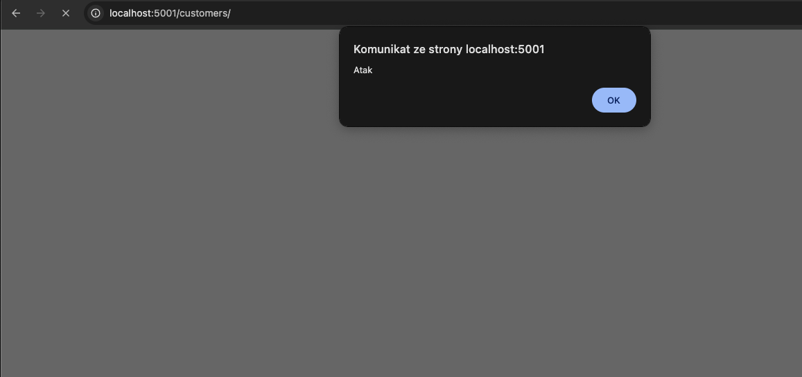
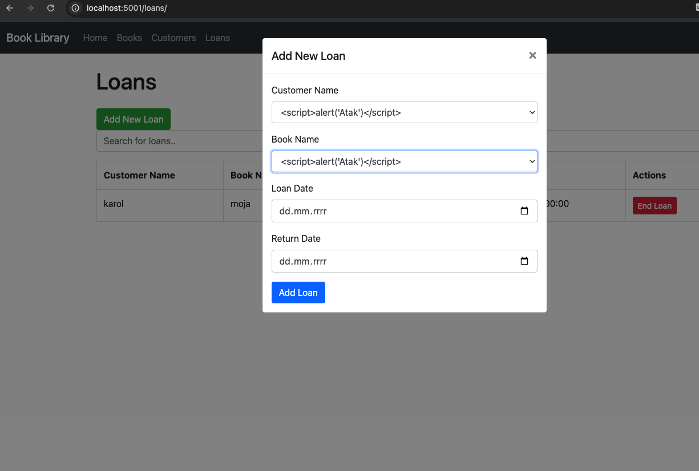
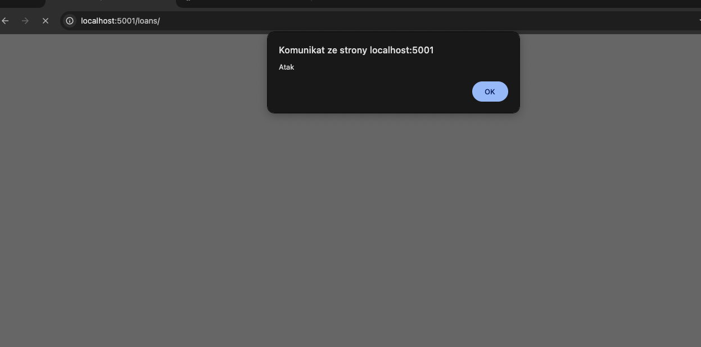

# Podatności w aplikacji
## Książki
W aplikacji zostały znalezione następujące podatności:
Podczas dodawania książki jako jej nazwe oraz autora można dodać skrypt, który zostanie zapisany do bazy.

Skrypt wykona się podczas wyświetlania listy

Podatność ta występuję w sposób analogiczny podczas edycji książki
## Klienci
Analogiczna podatność występuje podczas dodawania klientów

Skrypt wykona się podczas wyświetlania listy

Podatność ta występuję w sposób analogiczny podczas edycji klienta

## Wypozyczenia
Kolejna podatność występuję przy tworzeniu wypozyczenia przy wyborze ksiązki lub autora, których nazwa jest zainfekowana.
Ewentualnie mozna w konsoli zmienić kod HTML i dodać opcje w której value będzie zawierało exploita.

Ponownie skrypt zostanie wykonany przy wejściu na listę 

# Rozwiązania podatności
W ramach poprawki dodałem:
- Ograniczenie liczby znaków w request modelach, aby odpowiadały ograniczeniom w bazie
- Listę dozwolonych znaków dla odpowiednich pól
- Dodatkowo skorzystałem z biblioteki `bleach`, która odpowiada za sanityzacje danych wejściowych

# Testy jednostkowe
Został napisany jeden przykłdowy test dla nazwy ksiązki, sprawdza on tylko czy nazwa ksiązki zawiera dopuszczalne znaki.

